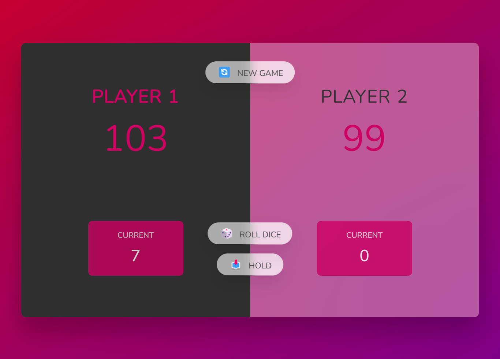

# Pig Game 🎲

This project is an implementation of the **Pig Game**, a simple and fun dice game for two players. The game is built with **TypeScript**, **HTML**, and **CSS**, featuring a responsive UI and dynamic game logic.

## 📜 Rules of the Game

1. The game is played by 2 players in turns.
2. Each player's goal is to score **100 points** or more before the other player.
3. On a player's turn:
    - The player rolls a dice.
    - The rolled number is added to their **current score**, unless a `1` is rolled.
    - If the player rolls a `1`, their current score resets to `0` and it's the next player's turn.
4. A player can choose to "Hold" their score:
    - The current score is added to their **total score**.
    - It becomes the next player's turn.
5. The first player to reach **100 points** wins the game!

---

## 💻 Live Demo

Add a link here (if deployed or hosted): `[Live Demo](#)`

---

## 🛠 Features

- **Dynamic Dice Rolls**: Random dice rolls with appropriate dice images.
- **Turn Switching Logic**: Automatically switches turn upon rolling a `1` or choosing to "Hold".
- **Simple & Intuitive UI**:
    - Displays the current and total scores.
    - Highlights the active player.
- **Fully Responsive Design**: Works across devices.

---

### 📂 Project Structure
